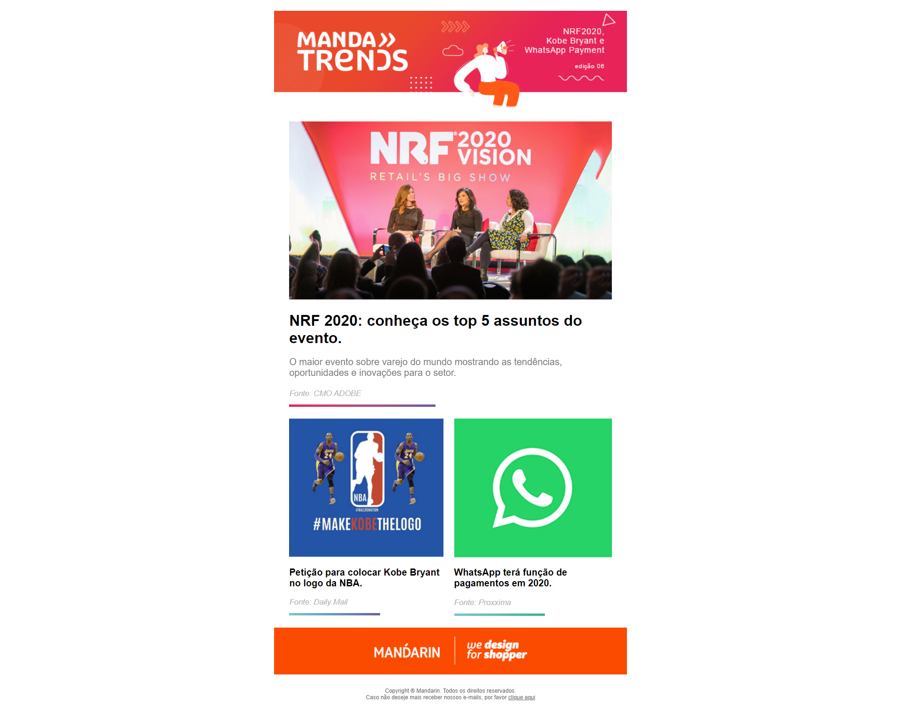

  

<h3 align="center">
  Landing Page Mandarin
</h3>

<blockquote align="center">Teste desenvolvido para o processo seletivo da Agência Mandarin.</blockquote>
 

  

  

  <a href="#about-the-project">Sobre o projeto</a> 

## Sobre o projeto

Neste teste da agência Mandarin, criei uma landing page utilizando conceitos de HTML 5 e CSS Flexbox, recebi o arquivo PSD e segui conforme o layout enviado.

Agradeço a Agência Mandarin pela oportunidade.